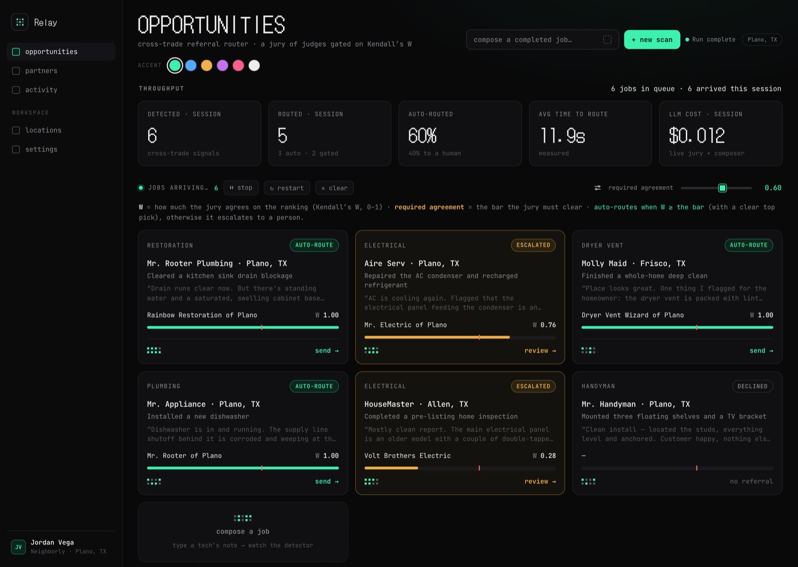
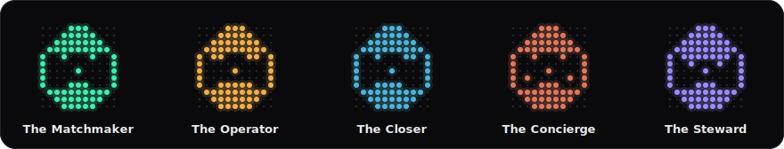

# Relay

> **A cross-trade referral router for the home-services trades.** When a trades pro closes a job, Relay detects an adjacent cross-trade referral opportunity, retrieves the best in-network partner from a federated brand-and-geography graph, puts the routing to a **jury of diverse LLM judges** and measures their agreement, drafts the customer handoff — then auto-routes the confident referrals and escalates the ambiguous ones to a human.

A working prototype of a marketplace **activation** loop: turning every completed job into the *right* cross-trade referral, automatically and safely.



## The problem it targets

In a trades referral network — e.g. a Mr. Rooter plumber who spots water damage and should hand the customer to a restoration partner — value leaks whenever a completed job *doesn't* become a referral. The growth metric that matters is **activation**: referrals generated per completed job, and locations that fire at least one referral a month. Relay attacks that gap by making the referral happen on its own, with an **agreement gate** so automation doesn't degrade quality.

## Getting started

You need [**Bun**](https://bun.sh) and **Node ≥ 20**. From a terminal:

```bash
# 1 — install Bun (skip if you already have it)
curl -fsSL https://bun.sh/install | bash

# 2 — clone and install dependencies
git clone https://github.com/technicallynadi/relay.git
cd relay
bun install

# 3 — start the app
./run.sh dev
```

Then open **http://localhost:3000**. You'll land on the live **Opportunities** feed and can start clicking cards immediately — **no API keys, no database, no Docker**. Relay runs fully deterministically out of the box (the detector, retrieval, the jury-by-weights, and the gate all work with zero network calls). Stop the server anytime with `Ctrl-C`.

> `./run.sh dev` auto-selects a compatible Node ≥ 20 for you (via nvm + the checked-in `.nvmrc`). Plain `bun run dev` also works if your `node` is already ≥ 20.

**Next:** walk through **Using it** below. To turn on the real LLM jury or the self-growing feed, see [Optional API keys](#optional-api-keys).

## Using it — a 2-minute tour

Relay opens on **Opportunities**: a live feed of completed jobs where it spotted a cross-trade referral. Each card shows the target trade, the brand + location, the tech's note (the signal it read), the chosen partner, and a **decision badge**:

- **auto-route** (mint) — the jury agreed enough; Relay would fire this on its own.
- **escalated** (amber) — the jury split, or the top pick was too close to the runner-up; a human decides.
- **declined** (grey) — no cross-trade signal in the job; nothing to refer (this is the system being precise, not a failure).

Try these four things:

1. **Route a card.** Click any card. The engine streams in below: the **detector** finds the cross-trade signal, the **retriever** pulls candidate partners, a **jury of five judges** each ranks them, and Relay measures their agreement with **Kendall's *W***. Then a **human gate** with the drafted customer message — **Save & send** fires it (simulated by default) and moves it to **Activity**; the card leaves the feed.
2. **Drag the trust dial.** Top-right of the feed: **required agreement**. It's the "how unanimous must the jury be before Relay routes on its own" knob. Drag it up → more jobs escalate to a human; down → more auto-route. The whole board re-decides live.
3. **Compose your own job.** The dashed **compose a job** card (or **+ new scan** in the top bar). Type a tech's note like *"Finished an AC tune-up — the breaker panel was scorched and hot to the touch."* → **run detector**. It drops into the feed as a card and routes live, so you can prove the detection isn't canned.
4. **Read the federated graph** (below the feed). Trades linked by **weighted, directed** cross-trade edges; routing lights the path (origin trade → adjacency edge → target trade → the partners pulled for it) and drops those partners onto a **geography scatter** so proximity is something you can see. Hover any edge or node to inspect it.

Other views in the sidebar: **Partners** (the partner directory), **Locations** (the 19 Neighborly brands in the Plano service area), **Activity** (the referrals you've sent), and **Settings** (accent theme, operator profile, and the Google-Places + delivery adapter seams).

### Live feed (optional)

The board is seeded so it's never empty. For a feed that grows on its own, run the ingestion worker in a **second shell**:

```bash
./run.sh worker         # a cron pulls a completed-job every ~6s → routes it → prepends to the feed
```

Each tick synthesizes a plausible job-close, routes it through the same detect → retrieve → jury pipeline, and prepends the opportunity (newest first). Stop / restart / clear it from the board's control row; `WORKER_CRON` overrides the schedule. In production this worker is an Inngest/cron consumer of real "job closed" events from the brands' field-service systems.

## Optional API keys

Everything above works with **no keys**. To go live, `cp .env.example .env` and add any of:

| Key | What it unlocks |
|---|---|
| `OPENROUTER_API_KEY` | **The main one.** The five judges run across genuinely different model families (the evidence-backed diversity) and the composer writes the customer message with a real model. |
| `OPENAI_API_KEY` | Semantic embeddings for retrieval — precomputed **once** at seed time (`./run.sh seed`), so there are zero embedding calls during the demo. |
| `TWILIO_*` / `RESEND_API_KEY` | The human gate's **Send** actually texts/emails the handoff instead of simulating it. |
| `GOOGLE_PLACES_API_KEY` | Pull **live** local partners for each opportunity's target trade instead of the seeded graph. |

With no OpenRouter key the judges fall back to their deterministic criteria-weights — the full detect → jury → gate arc still runs, so the demo never depends on the network.

## How it works

```
Completed job event
   │
   ▼
1. Opportunity Detector ─ is there a cross-trade referral? to which trade?
   │
   ▼
2. Partner Retriever  ◄─ Hybrid retrieval (BM25 + pgvector)
   │                     ├─ Brand-capability subgraph (19 Neighborly brands → trades → adjacencies)
   │                     └─ Local partner graph (capability sheets + reviews)
   ▼
3. Jury (Panel of LLM judges)  ─ diverse judges rank candidates → Kendall's W concordance gate   ★ showpiece
   │
   ▼
4. Handoff Composer  ─ drafts the customer message + internal referral record
   │
   ▼
   HUMAN GATE: [ Send ] [ Edit ] [ Skip ]
   │
   ▼
   Referral fired (simulated) + audit log + outcome → eval calibration
```

The feed, the worker, the detector, and the retriever are **deterministic** (no LLM). Model calls happen only when you *route* a specific opportunity — so cost scales with actions, not feed volume.

## The showpiece: a jury with a concordance gate

The routing decision is fuzzy and has no ground-truth answer, so a single model's pick is untrustworthy. Instead Relay convenes a **jury** — a **Panel of LLM judges (PoLL)** — in which each judge independently *ranks* the candidate partners. Two questions decide what happens next:

1. **Do the judges agree?** Jury concordance is measured with **Kendall's *W*** (the coefficient of concordance), a standard rank-agreement statistic in `[0, 1]`: `W = 1` is a unanimous ranking, `W = 0` is no agreement.
2. **Who wins?** The individual rankings are aggregated into a consensus order by **Borda count**, and the top-ranked partner must clear the runner-up by a margin.

**The decision:** auto-route when concordance clears the required-agreement threshold **and** the Borda winner clears the runner-up by the top-1 margin guard; otherwise escalate to a human. The threshold is the **live UI dial** (default `0.6`).

The five judges run across **different model families** because the diversity is the load-bearing part — disjoint families don't share blind spots, so their *agreement* actually carries information (Verga et al. 2024, [arXiv:2404.18796](https://arxiv.org/abs/2404.18796)). Each judge is an explicit **criteria-weight vector** (over fit / capacity / proximity / conversion) initialized from an **OCEAN / Big Five** personality prior — the personality sets the weights *in code*; the models are never told to "act neurotic" (persona-prompting degrades reasoning and only fakes diversity).

### The judges

Five lenses, deliberately spanning **different model families** so their agreement means something (the models are set in `relay.config.yaml`):



| Judge | The lens it argues from |
|---|---|
| **The Matchmaker** | the best technical fit for the job, even out-of-network |
| **The Operator** | can the partner *actually deliver*? — capacity & reliability |
| **The Closer** | the odds the referral converts to a booked job |
| **The Concierge** | protecting the customer's experience & the relationship |
| **The Steward** | defending in-network brand standards & low-risk choices |

Each lens is an OCEAN / Big-Five prior that derives that judge's criteria weights in code — never role-played in the prompt. Each judge's specific model is shown live on its card and set in `relay.config.yaml` (swap any of them there and reload); with no key every judge falls back to its deterministic weights. Their built-in tension is the point: the Matchmaker's "best fit" pulls out-of-network while the Steward defends in-network, and the Closer's "will it convert" trades off against the Operator's "can they deliver" — so when they *do* concur, that agreement is real signal.

**Agreement is not correctness.** *W* measures whether the judges *concur*, not whether they're *right* — which is exactly why they span different families (to keep errors from lining up) and why the **human gate** stays as the correctness backstop. *W* decides whether to *defer*, not whether the answer is true.

## Cost & monitoring

The engine is deterministic-first, so **cost scales with actions, not volume**: the feed, the ingestion worker, the detector, and the retriever make **zero** LLM calls — you only spend when you *route* a specific opportunity (a drill-in or a compose), which fires the jury + composer.

Relay meters that spend live:

- A **"LLM cost · session"** tile in the KPI row — the real dollar total, from each call's token usage priced through a per-model table (`lib/cost.ts`). It reads **`$0.00 · deterministic — free`** when no key is set.
- A **per-route readout** in the pipeline panel — e.g. `$0.014 · 6 calls · 2,340 tok` for the route you just ran.

With a key, a route (≈5 judges + 1 composer) runs **~1–2¢**; a full demo of a dozen routes is well under $0.50. To spend less: drop the one premium judge (diversity of *families* carries the signal, not size), shrink the panel to three, or reserve the LLM jury for the ambiguous cases the cheap deterministic score can't settle.

**Runs out of credits? It keeps going.** If a call fails for lack of funds, the model adapter retries down a chain of cheaper models (`LLM_FALLBACK_MODELS`, default `gpt-4o-mini → gemini-2.5-flash`) and, if those are exhausted, degrades to the **deterministic jury** — always free. The demo never dies on an empty balance; it just gets cheaper.

## Verify

```bash
bun test                   # Kendall's W concordance + Borda math + scenario behavior
bun run scripts/smoke.ts   # the full pipeline end-to-end
```

## Stack

TypeScript · Bun · Next.js (App Router) · PGlite (embedded Postgres + pgvector, no Docker) · `croner` (the ingestion worker) · a provider-agnostic LLM/embeddings adapter (OpenRouter for the cross-family judge panel; OpenAI or local MiniLM for embeddings).

## Status

Prototype, runs locally. Real retrieval (PGlite + pgvector), a real jury, real job-close signals; referral delivery and outcomes are simulated behind adapter seams (Twilio/Resend for Send, Google Places for partner sourcing). Auth and deployment are roadmap, not in this build.

## Method & prior art

The jury is a **Panel of LLM judges (PoLL)** in the sense of Verga et al. 2024 — diverse models, disjoint families, aggregated. Agreement is quantified with **Kendall's coefficient of concordance *W*** (Kendall & Babington Smith, 1939). Judge personalities are **OCEAN / Big Five** weight vectors used only to initialize deterministic criteria weights, never as a role-play prompt. The consensus winner is chosen by **Borda count**; **Kemeny–Young** (the Condorcet-consistent exact aggregator) is available as a gold-standard cross-check.
